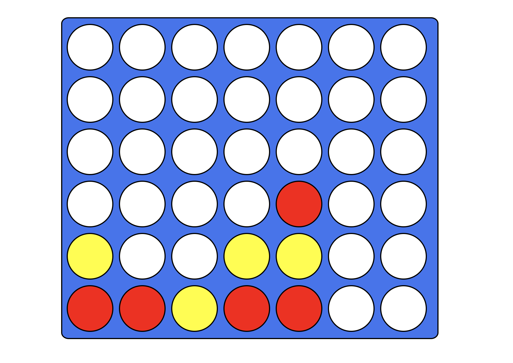

# Connect Four - Built With React

A re-creation of the popular board game connect Four built using React. (Game works but some additional features are still WIP)

<!-- # Visit the deployed app

You can find the deployed app via the following link: https://Thatguy560.github.io/CalculatorReact -->

# Installation

1. Clone the repo

2. type "git clone https://github.com/Thatguy560/Connect4React.git" in the terminal

3. cd into 'Connect4React' (Change directory's)

4. npm install

# Using The App Locally

1. Open up a terminal in your text editor and type 'npm start'

2. This should then automatically open the app on your browser, however if it doesn't just open up any browser of your choosing and type in the url "http://localhost:3000/".

3. Once the page is loaded, enjoy the game! (Red starts first followed by Yellow)

# Technologies Used

#### React, Javascript, HTML/CSS

